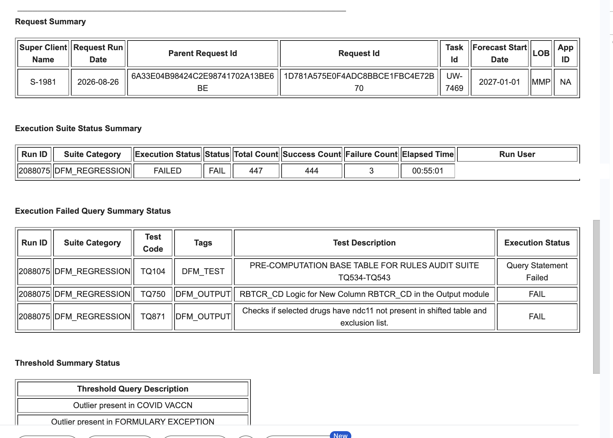
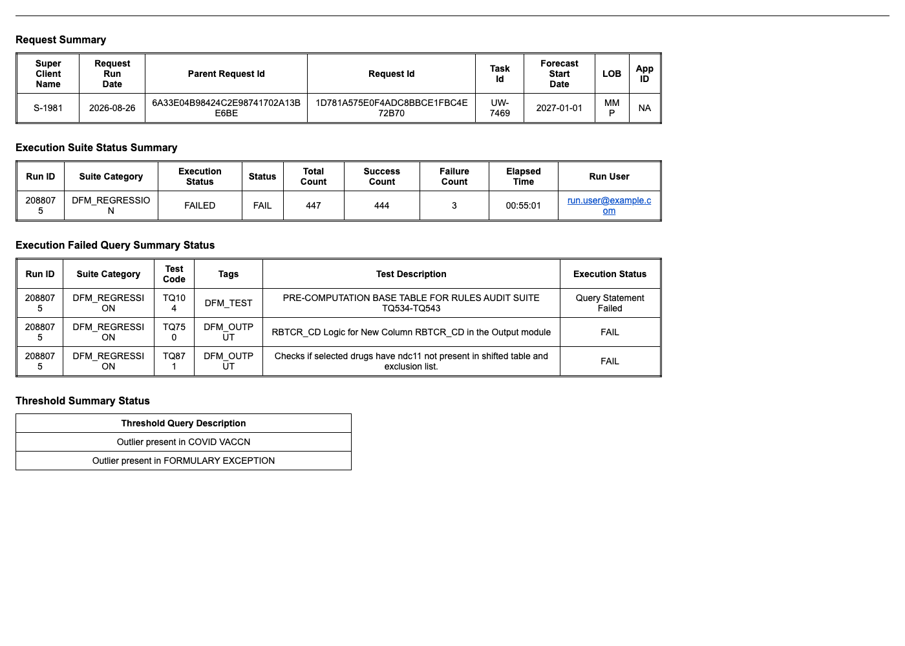

# CVS DFM Regression Report — Native Delivery (no SMTP)

Deliver CVS's multi-section DFM regression report to stakeholders using **Databricks-native
features only** — no SMTP relay, no egress whitelist, no external email provider.

CVS migrated to serverless. Today the report is emailed via **custom code + an SMTP relay**,
which on serverless means whitelisting SMTP egress and maintaining a relay. This repo shows
**two production-ready native solutions**, side by side, with honest trade-offs and exactly
what each one produces.

---

## The report

Four sections rendered from Unity Catalog tables. Reproduced **byte-for-byte** in
[`common/report_template.html`](common/report_template.html).

| Customer source | Exact reproduction |
|---|---|
|  |  |

---

## The two solutions

### 🅰 [SQL Alerts](approaches/01-sql-alerts/) — *event-driven, in the inbox*

A SQL Alert watches the run table; the instant `failure_count > 0`, **Databricks sends an
email** to subscribers. Event-driven and immediate.

- ✅ Fires **the moment the table changes** (table-triggered job)
- ✅ Email lands **in the inbox**, sent by Databricks (no SMTP)
- ⚠️ Databricks' email sanitizer **strips table borders** — content is all there, but the
  boxed grid is not, and it's wrapped in Databricks chrome

### 🅱 [AI/BI Dashboard + Subscription](approaches/02-aibi-api/) — *clean, scheduled snapshot*

A hidden, dynamic dashboard (4 table widgets) is rendered to a **PDF/PNG snapshot** and
emailed on a schedule. Because it's a rendered image, the **formatting survives**.

- ✅ **Clean, bordered tables** — pixel-clean, exactly like the source
- ✅ **Dynamic** — always the latest run; **hidden** — stakeholders get the email, not the dashboard
- ⚠️ **Scheduled (cron), not event-driven** — no "on table change" trigger exists; a frequent
  cron is near-real-time

### Side by side

| | 🅰 SQL Alerts | 🅱 AI/BI Subscription |
|---|---|---|
| Delivery | Email (control plane) | Email (rendered PDF/PNG) |
| Trigger | **Event — table change** | **Schedule — cron** |
| Table borders | ❌ stripped by sanitizer | ✅ preserved |
| Databricks chrome | Yes (logo/footer) | No (clean snapshot) |
| Group email | ✅ via destination | ✅ via destination |
| Native / no SMTP | ✅ | ✅ |

**Best of both:** pair them — the **alert** fires instantly ("failures detected"), the
**AI/BI snapshot** carries the clean formatted report. That's the closest native answer to
*clean + dynamic + pushed-on-change*.

---

## Sending to a group email

Both solutions can deliver to a **group / distribution-list** address via a Databricks
**notification destination** (EMAIL type) — created once by a workspace admin, then
referenced by id:

```bash
databricks notification-destinations list          # find/confirm a group destination
```

- **AI/BI:** set `SUBSCRIBER_DESTINATION_IDS` in `approaches/02-aibi-api/setup_subscription.py`
- **SQL Alerts:** add `{"destination_id": "<id>"}` to `subscriptions` in `approaches/01-sql-alerts/setup_alert.py`

You can also list multiple individual users as subscribers.

---

## The core trade-off

> **Clean borders · in the email body · instant on change — pick two.**

- 🅰 SQL Alerts → instant + inbox, borders sanitized out
- 🅱 AI/BI → clean + inbox, scheduled (not instant)
- External email API → clean + inbox + instant, **but not Databricks-native** (see `reference/`, not CVS-approved)

---

## Deployed (e2-demo-field-eng · `users.narasimha_kamathardi`)

| Resource | Name / ID |
|---|---|
| Tables | `dfm_request_summary`, `dfm_suite_status`, `dfm_failed_queries`, `dfm_threshold_summary` |
| Volume | `dfm_reports` |
| Alert (🅰) | `cvs-dfm-regression-alert` · job `cvs-dfm-alert-email` |
| Dashboard (🅱) | `CVS DFM Regression Report` · `01f1bcff3a2e143eb7910e6ca3d8a865` |

---

## Layout

```
common/                      Shared: exact-format template, data setup, source screenshots
  report_template.html         Canonical exact-format template (borders intact)
  render_report.py             Local preview / UC read helper
  setup_uc.py                  Create + seed source tables and the reports Volume
approaches/
  01-sql-alerts/               🅰 SQL Alerts solution
  02-aibi-api/                 🅱 AI/BI dashboard + subscription solution
reference/
  webhook/                     Native Teams/Slack card + link
  external-email-api/          Graph/SES/Resend — clean HTML in body, but NOT CVS-approved
```

## Quick start

```bash
pip install jinja2
python3 common/setup_uc.py                          # tables + volume (--profile e2-demo-field-eng)
python3 common/render_report.py                     # verify the exact format locally

python3 approaches/01-sql-alerts/setup_alert.py     # 🅰 SQL Alerts
python3 approaches/02-aibi-api/build_dashboard.py   # 🅱 build dashboard
python3 approaches/02-aibi-api/setup_subscription.py <dashboard_id>   # 🅱 schedule + subscribe
```

Each approach folder has its own README with mechanics, screenshots, and trade-offs.
