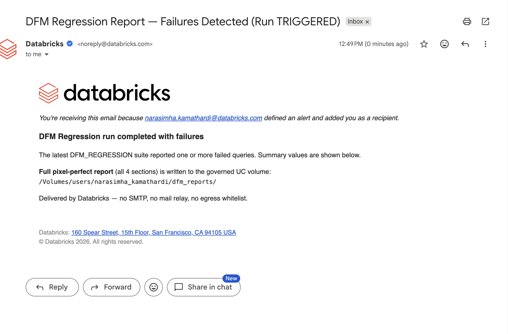
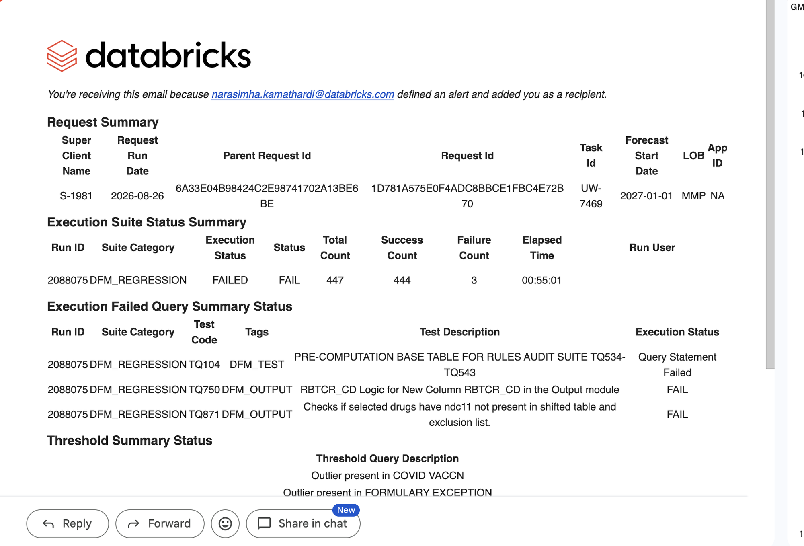
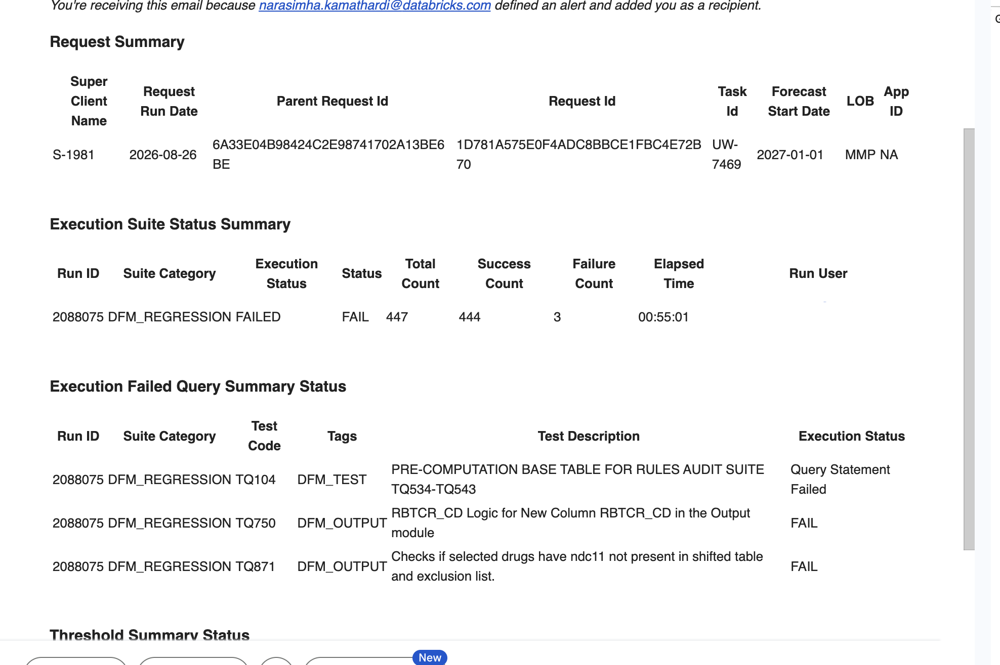

# Approach 01 — SQL Alerts

> **Native Databricks email, zero SMTP, zero external provider.** A SQL Alert watches the
> run table; when `failure_count > 0` it fires and **Databricks itself sends the email** to
> subscribers via its control plane. Nothing to whitelist, no relay, no API key.

## How it works

```
dfm_suite_status ──> Query (cvs-dfm-run-summary) ──> Alert (failure_count > 0)
                                                        │
                                          sql_task job  ▼
                                     Databricks control plane sends email ──> stakeholders
```

- **Query** `cvs-dfm-run-summary` — returns the latest run's summary row.
- **Alert** `cvs-dfm-regression-alert` — condition `failure_count > 0`; `custom_body` holds the report HTML (`email_report_body.html`).
- **Job** `cvs-dfm-alert-email` — a `sql_task` alert with stakeholders as `subscriptions`. Run it (or schedule it) to evaluate + notify.

## Setup

```bash
python3 ../../common/setup_uc.py     # source tables + volume (run once)
python3 setup_alert.py               # query + alert + job
```

## ✅ What you get / ⚠️ what you don't

The alert email delivers **all four report sections and every value**. But Databricks'
alert-email pipeline **sanitizes the HTML** — it keeps text, structure, bold, and links,
and **strips every table/cell border** (both CSS `style` *and* the `border="1"`
attribute), then wraps it in Databricks chrome (logo header, "you're receiving this
because…", footer).

| Stage | Screenshot |
|-------|-----------|
| Summary-only body |  |
| Full report content injected |  |
| Even with `border` attributes (still stripped) |  |

**Rule of thumb:** *clean bordered tables + inside the email body + Databricks-only* — pick
two, never all three. This approach optimizes for **Databricks-only + inside the inbox**,
trading away pixel-clean borders.

## When to use this
- Stakeholders must receive the report **in their inbox**, and
- Only **Databricks-native** tooling is approved, and
- A slightly plainer (borderless) layout inside Databricks chrome is acceptable.

If you need the **exact, clean, bordered** format → see the AI/BI approach
(`approaches/02-aibi-api/`, emails a rendered snapshot) or serve `common/report_template.html`
via a Databricks App and link to it.

## Files
- `setup_alert.py` — creates the query + alert + sql_task job
- `email_report_body.html` — the report HTML injected into the alert body
- `jobs/job_alert.json` — the alert job spec
- `docs/` — the three alert-email rendering stages
